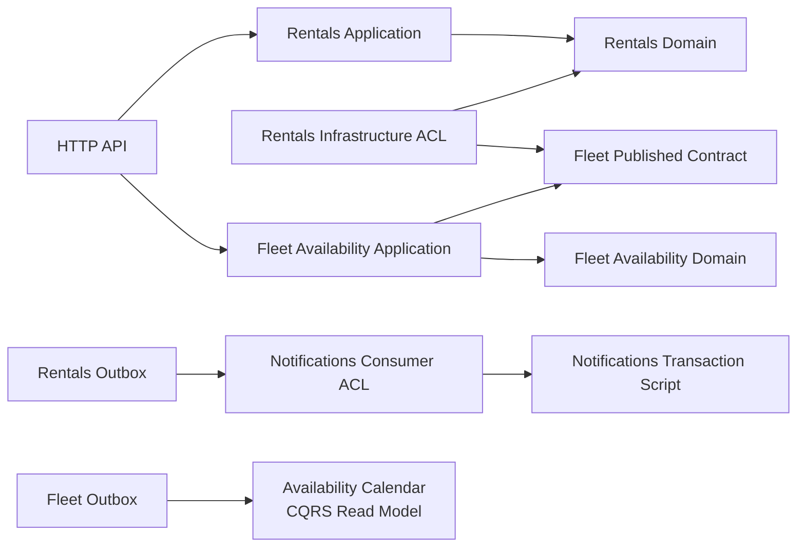

# Equipment Rental Platform

[](https://github.com/muratyildi/equipment-rental-ddd/actions/workflows/ci.yml)

> A learning-first, production-minded Domain-Driven Design reference built with
> .NET 10.

**Status:** `v1.0.0` stable · 81 tests · zero-warning Release
build · modular monolith by evidence-based decision

[Türkçe](README.tr.md) · [Architecture](docs/architecture/README.md) ·
[Domain discovery](docs/discovery/01-product-vision.md) ·
[Decision records](docs/decisions/README.md)

## Why this repository exists

Many DDD samples begin with folders named `Entities`, `Repositories`, and
`Services`. This repository begins with the business:

1. product vision and domain experts;
2. Big Picture Event Storming;
3. ubiquitous language;
4. subdomain classification;
5. bounded contexts and their context map;
6. only then, executable domain behavior.

The goal is not to collect every popular pattern. The goal is to show why a
pattern is selected, what problem it solves, what it costs, and when the
decision should be revisited.

## Domain

The system coordinates industrial equipment quotation, reservation, delivery,
rental, return, maintenance, and billing.

The first vertical slice integrates the **Rentals** and **Fleet Availability**
bounded contexts:

```text
Draft order
    → add commercial lines
    → quote
    → request one Fleet Availability commitment per line
    → confirm
```

A rental cannot be confirmed unless:

- its quote is active;
- it has at least one line;
- every line has an availability commitment;
- each commitment covers the exact accepted rental period;
- all lines use the same currency.

These rules live in the domain model and are verified by executable examples.

## DDD evidence

| Concern | Where it is made explicit |
|---|---|
| Business problem and domain experts | [Product vision](docs/discovery/01-product-vision.md) |
| Commands, events, policies, hotspots | [Big Picture Event Storming](docs/discovery/02-big-picture-event-storming.md) |
| Context-scoped language | [Ubiquitous Language](docs/discovery/03-ubiquitous-language.md) |
| Core/supporting/generic analysis | [Subdomains and bounded contexts](docs/discovery/04-subdomains-and-bounded-contexts.md) |
| Team/model relationships | [Context Map](docs/discovery/05-context-map.md) |
| Aggregate and invariants | [`RentalOrder`](src/Modules/Rentals/EquipmentRental.Modules.Rentals.Domain/RentalOrders/RentalOrder.cs) |
| Capacity consistency boundary | [`AvailabilitySchedule`](src/Modules/FleetAvailability/EquipmentRental.Modules.FleetAvailability.Domain/Schedules/AvailabilitySchedule.cs) |
| Value objects | [`Money`](src/Modules/Rentals/EquipmentRental.Modules.Rentals.Domain/RentalOrders/Money.cs), [`RentalPeriod`](src/Modules/Rentals/EquipmentRental.Modules.Rentals.Domain/RentalOrders/RentalPeriod.cs) |
| Domain facts | [`RentalOrderEvents`](src/Modules/Rentals/EquipmentRental.Modules.Rentals.Domain/RentalOrders/RentalOrderEvents.cs) |
| Executable business examples | [Rentals domain tests](tests/Modules/Rentals/EquipmentRental.Modules.Rentals.Domain.Tests/RentalOrders/RentalOrderTests.cs) |
| Enforced dependency direction | [Architecture tests](tests/Architecture/EquipmentRental.ArchitectureTests/ModuleDependencyTests.cs) |
| Aggregate persistence and concurrency | [Persistence guide](docs/architecture/persistence.md) |
| Reliable event publication | [Domain events and Outbox guide](docs/architecture/domain-events-and-outbox.md) |
| Idempotent event consumption | [Inbox guide](docs/architecture/idempotent-consumers-and-inbox.md) |
| CQRS projection and eventual consistency | [Availability Calendar guide](docs/architecture/cqrs-availability-calendar.md) |
| Long-running workflow and compensation | [Rental Confirmation Process Manager](docs/architecture/rental-confirmation-process-manager.md) |
| Observability, resilience, and security | [Operational Readiness guide](docs/architecture/operational-readiness.md) |
| Evidence-based deployment evolution | [Service Extraction Assessment](docs/architecture/service-extraction-assessment.md) |
| Release scope and publication evidence | [v1.0.0 release record](docs/releases/v1.0.0.md) |
| Decision context and trade-offs | [ADR index](docs/decisions/README.md) |

## Architecture

The system starts as a modular monolith. A bounded context is a model boundary,
not automatically a microservice.



- **Domain** owns business language, state transitions, and invariants.
- **Application** coordinates use cases but does not own business rules.
- **Infrastructure** implements technical adapters.
- **API** is the composition root and translates HTTP contracts.

There is intentionally no mediator package in the first slice. Explicit
handlers make the use-case boundary visible before introducing dispatch
machinery.

The service-extraction assessment deliberately keeps every context in the
modular monolith. Notifications is the lowest-risk technical pilot and Fleet
Availability is the strongest possible operational candidate, but neither has
a measured production driver yet. Predeclared thresholds, fitness functions,
and a reversible extraction playbook keep that decision testable rather than
aspirational.

Read the full [architecture guide](docs/architecture/README.md).

## Technology

- .NET 10 LTS
- C# 14
- ASP.NET Core Minimal APIs
- EF Core 10 and PostgreSQL
- Testcontainers for real-database integration tests
- xUnit
- SLNX solution format
- Central Package Management
- Built-in .NET analyzers with warnings treated as errors

Each bounded context owns a separate PostgreSQL schema and DbContext.
PostgreSQL `xmin` provides optimistic concurrency at aggregate boundaries.
Selected domain facts are translated into versioned integration events and
stored in a schema-local transactional Outbox. A background worker publishes
them with at-least-once semantics. Notifications consumes confirmed-rental
events through a transactional Inbox, making duplicate deliveries safe.
Fleet Availability projects capacity and commitment events into a separate,
day-oriented calendar model with its own transactional Inbox.
Business endpoints require scoped API keys and are rate limited. JSON logs,
correlation IDs, readiness probes, runtime metrics, Outbox dead-letter, and
Process Manager intervention states make operational failures visible.

## Run

Prerequisites:

- .NET SDK `10.0.103` or a compatible later .NET 10 feature band;
- Docker for PostgreSQL and integration tests.

```bash
dotnet restore EquipmentRental.slnx
dotnet tool restore
docker compose up -d postgres
dotnet tool run dotnet-ef database update \
  --project src/Modules/Rentals/EquipmentRental.Modules.Rentals.Infrastructure \
  --context RentalsDbContext
dotnet tool run dotnet-ef database update \
  --project src/Modules/FleetAvailability/EquipmentRental.Modules.FleetAvailability.Infrastructure \
  --context FleetAvailabilityDbContext
dotnet tool run dotnet-ef database update \
  --project src/Modules/Notifications/EquipmentRental.Modules.Notifications.Infrastructure \
  --context NotificationsDbContext
dotnet tool run dotnet-ef database update \
  --project src/Modules/FleetAvailability/EquipmentRental.Modules.FleetAvailability.ReadModel \
  --context AvailabilityCalendarDbContext
dotnet tool run dotnet-ef database update \
  --project src/Modules/Rentals/EquipmentRental.Modules.Rentals.ProcessManagers \
  --context RentalConfirmationProcessDbContext
dotnet build EquipmentRental.slnx --configuration Release
dotnet test EquipmentRental.slnx --configuration Release
dotnet run --project src/Api/EquipmentRental.Api
```

Alternatively, run the complete containerized environment:

```bash
cp .env.example .env
# Replace both example keys in .env.
docker compose up --build
```

The API starts with the URL shown in the terminal. Example requests are
available in
[`EquipmentRental.Api.http`](src/Api/EquipmentRental.Api/EquipmentRental.Api.http).

## Current quality gate

- 22 domain behavior tests
- 4 application orchestration tests
- 18 architecture and service-extraction fitness tests
- 24 PostgreSQL integration tests
- 13 API boundary, security, and observability tests
- Release build with zero warnings
- End-to-end smoke test of create → quote → commit availability → confirm

## Roadmap

- [x] Domain discovery and initial context map
- [x] .NET 10 modular-monolith walking skeleton
- [x] First rich domain aggregate and value objects
- [x] Domain and architecture tests
- [x] Fleet Availability bounded context and published contract
- [x] PostgreSQL persistence with EF Core and optimistic concurrency
- [x] Domain-event mapping and transactional outbox
- [x] At-least-once Outbox publisher with claim, retry, and stable message IDs
- [x] Idempotent integration-event consumer with transactional Inbox
- [x] CQRS availability calendar
- [x] Rental confirmation process manager with timeout and compensation
- [x] Observability, resilience, security, and containerized local environment
- [x] Evaluate service extraction using measured operational drivers

## Learning material

The repository contains original English study guides based on Eric Evans's
*Domain-Driven Design* and Vlad Khononov's *Learning Domain-Driven Design*.
They compare, explain, and apply the ideas without reproducing the copyrighted
books.

- [DDD source review](docs/learning/00-source-review.md)
- [Learning roadmap](docs/learning/01-learning-roadmap.md)
- [Eric Evans's Blue Book](docs/learning/02-blue-book-review.md)
- [Historical and integrated reading guide](docs/learning/03-historical-and-integrated-reading-guide.md)

## License

Licensed under the [MIT License](LICENSE).

See [CONTRIBUTING.md](CONTRIBUTING.md), [SECURITY.md](SECURITY.md), and the
[changelog](CHANGELOG.md) for repository policies and release history.
