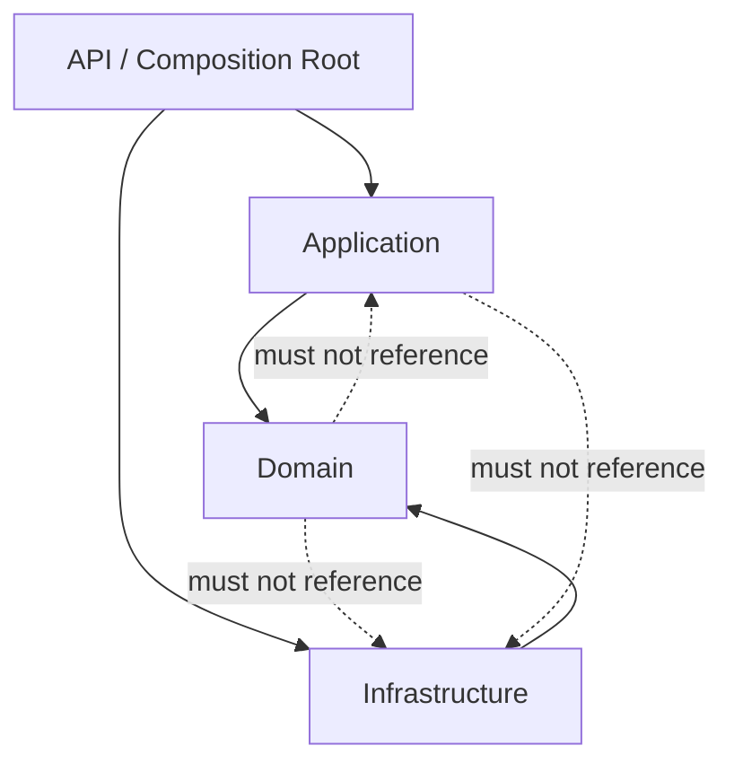
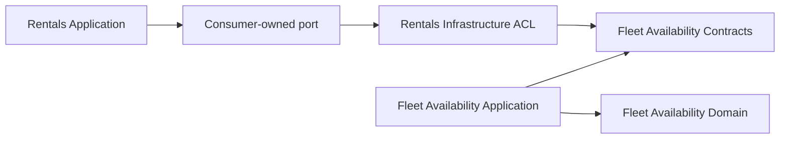

# Architecture

## Architectural style

The application starts as a **modular monolith**. This is a deployment decision,
not a shortcut around bounded contexts.

Each bounded context owns:

- its language and model;
- its application use cases;
- its persistence model and schema;
- its public integration contracts;
- its tests and lifecycle.

Implemented contexts:

- Rentals
- Fleet Availability
- Notifications

## Dependency rule

The architecture tests enforce the forbidden project directions. Project
references are not treated as documentation alone.

## Context boundary

Rentals does not reference Fleet Availability internals:

The published contract contains primitives and message-shaped records. It does
not expose an aggregate, repository, or domain Value Object.

## Layer responsibilities

### Domain

- Ubiquitous language
- Aggregate state transitions
- Invariants
- Value Objects
- Domain Events
- Repository port for aggregate lifecycle

The Domain project has no dependency on ASP.NET Core, EF Core, or another
project assembly.

### Application

- One explicit handler per use case
- Loading and saving aggregates
- Time and external-port orchestration
- Mapping domain state to application snapshots

Application handlers do not contain rules such as “every line needs a
commitment.” They ask the aggregate to perform the transition.

### Infrastructure

- Persistence adapters
- Message adapters
- External provider adapters

The production-facing adapters use EF Core and PostgreSQL. Every module owns
its DbContext, mappings, migrations, repository implementation, and database
schema. The Domain projects remain persistence-ignorant.

### API

- HTTP request and response contracts
- Authentication/authorization boundary
- HTTP status and Problem Details translation
- Dependency composition

The API does not mutate aggregate properties.

## Domain Event versus Integration Event

A Domain Event is an internal fact expressed in the bounded context's language.
It may contain domain-specific types.

An Integration Event is a stable, versioned message intended for another
context. It must not expose the aggregate's internal model.

The project records Domain Events inside aggregate methods. Infrastructure
maps only externally meaningful facts to primitive, versioned Integration
Events. The state change and Outbox message are committed atomically; transport
publication happens afterwards with at-least-once semantics.

The shared Eventing building block contains transport-neutral envelopes and
ports only. It does not know any business module. Each module owns its
integration contracts, mapping, Outbox table, and processor.

See [Domain Events and Transactional Outbox](domain-events-and-outbox.md).

Notifications consumes Rentals' published event through an Infrastructure ACL.
Its Application project does not reference Rentals. The Inbox row and
notification work item commit in one local transaction, so at-least-once
delivery does not duplicate the business effect.

See [Idempotent Consumers and Inbox](idempotent-consumers-and-inbox.md).

Fleet Availability publishes capacity and commitment facts to its own
Availability Calendar projection. The write aggregate protects overbooking;
the denormalized read model answers day-by-day queries. They are separate
models inside one bounded context, not separate microservices.

See [CQRS Availability Calendar](cqrs-availability-calendar.md).

Multi-line rental confirmation crosses several Fleet aggregate transactions.
A persisted Process Manager commits lines one at a time, confirms the Rental
when all succeed, and releases earlier commitments after rejection or timeout.
It depends on the consumer-owned Rentals port and never references Fleet
internals.

See [Rental Confirmation Process Manager](rental-confirmation-process-manager.md).

The HTTP host adds scoped machine-to-machine authentication, rate limiting,
safe correlation, JSON logs, liveness/readiness checks, and vendor-neutral
runtime instrumentation. Retry budgets end in explicit dead-letter or
operator-intervention states.

See [Operational Readiness](operational-readiness.md).

## Deployment evolution

Bounded Context, module, process, and service are deliberately treated as
different boundaries. The current codebase has no measured production driver
that justifies a service extraction, so every implemented context remains in
the modular monolith.

Notifications is the lowest-risk technical pilot because it consumes an
asynchronous published event through an Inbox. Fleet Availability is the
strongest potential operational candidate because its contention and scale
profile may diverge from Rentals. Both are hypotheses, not claims based on
fabricated traffic data.

The [Service Extraction Assessment](service-extraction-assessment.md) records
the evidence matrix and predeclared thresholds. The
[Service Extraction Playbook](service-extraction-playbook.md) defines
contract, data-ownership, cutover, and rollback steps if a threshold is later
crossed. Architecture fitness tests keep cross-module dependencies restricted
to published contracts while the deployment remains a monolith.

## Data ownership

The PostgreSQL implementation follows these rules:

- one schema per bounded context;
- a module writes only its own schema;
- no cross-context foreign keys;
- no cross-context repository;
- read models may combine published data without becoming write models.

`RentalsDbContext` writes only the `rentals` schema.
`FleetAvailabilityDbContext` writes only the `fleet_availability` schema.
`AvailabilityCalendarDbContext` writes only the derived
`fleet_availability_read` schema.
`RentalConfirmationProcessDbContext` owns the orchestration state in
`rentals_process_manager`.
Each context also owns a schema-local EF migrations history table.

Aggregate roots use PostgreSQL's `xmin` system column as an optimistic
concurrency token. A technical `updated_at_utc` touch ensures a child-entity
change also updates the root row, so concurrency protects the whole aggregate,
not only scalar root properties.

See the detailed [persistence and concurrency guide](persistence.md).

## Why no generic repository?

`IRentalOrderRepository` represents the lifecycle of one aggregate root in the
domain language. A generic `IRepository<TEntity>` would:

- imply that every entity is independently loadable;
- encourage persistence-shaped application code;
- obscure domain-specific retrieval intent;
- weaken aggregate boundaries.

## Why no mediator package yet?

Commands and queries are architectural concepts; a mediator is dispatch
machinery. Explicit handler injection keeps:

- call flow visible;
- dependencies honest;
- the first slice easy to debug;
- framework choice reversible.

A mediator can be introduced if pipeline behaviors, module dispatch, or handler
discovery provide measurable value.
