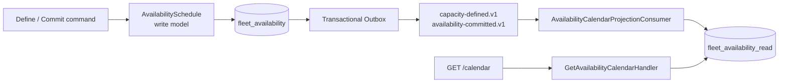

# CQRS Availability Calendar

This implementation treats CQRS as two purpose-specific models for the same
business facts—not as “two databases” or “add MediatR.”

## Problem

`AvailabilitySchedule` answers a decision question:

> Can this quantity be committed for this period without violating existing
> commitments?

It loads commitments, computes peak overlapping use, and protects the
overbooking invariant in one transaction. The calendar asks a different
question:

> For every day in the next 30 days, what are the total, committed, and
> available quantities for this category and location?

Recomputing that view through the aggregate couples query cost to commitment
volume and forces a decision model into a presentation shape.

## Selected model



| Model | Purpose | Storage | Consistency |
|---|---|---|---|
| `AvailabilitySchedule` | Decide whether to accept a commitment | Aggregate and commitments | Strong |
| Availability Calendar | Fast daily display | Denormalized daily rows | Eventual |

This is not a microservice boundary. Both models remain inside Fleet
Availability and the same deployment/PostgreSQL instance. Separate schemas and
DbContexts make ownership and migration lifecycles explicit.

## Projection tables

The `fleet_availability_read` schema contains:

- `availability_schedules`: total capacity by category/location;
- `availability_days`: committed quantity by `(schedule_id, date)`; and
- `inbox_messages`: processed message identity by consumer.

`available_quantity` is calculated as total minus committed so two stored
derived values cannot drift. Daily rows deliberately have no foreign key to
the schedule row because broker partitions or retry can deliver a commitment
before capacity. The delta can be stored first; the view becomes queryable when
capacity arrives.

## Published contracts and dependency boundary

The projection consumes only Fleet's versioned contracts:

- `fleet-availability.availability-capacity-defined.v1`
- `fleet-availability.equipment-availability-committed.v1`
- `fleet-availability.equipment-availability-released.v1`

The Read Model references no Fleet Domain, Application, or Infrastructure
assembly. Architecture tests enforce this. The consumer also verifies that the
envelope and payload event IDs match.

## Idempotency and atomicity

In one local transaction, the consumer checks `(consumer, message_id)`, applies
an unseen projection change, records the Inbox row, and commits both. Daily
deltas use PostgreSQL `INSERT ... ON CONFLICT DO UPDATE`. Sequential and
concurrent duplicate delivery cannot apply a delta twice.

## Query behavior

```http
GET /api/fleet-availability/calendar
    ?equipmentCategoryId={guid}
    &locationId={guid}
    &startDate=2030-08-10
    &endDateExclusive=2030-08-13
```

- The interval is half-open: `[startDate, endDateExclusive)`.
- Requests cover 1–366 days.
- Missing capacity projection returns `404 Not Found`.
- Days with no commitments are synthesized with `committedQuantity = 0`.
- Each result contains total, committed, and available quantity.

Immediately after a successful command, queries can briefly show old state.
Clients may poll; new commitment decisions must always use the aggregate, never
the read model.

## CQRS without MediatR or Event Sourcing

CQRS separates command and query models. MediatR is a dispatch library; Event
Sourcing reconstructs state from event history. Neither is a prerequisite.
Explicit handlers keep call flow visible, and the write model stores current
state. Integration Events exist for integration/projection, not as a complete
event-sourced aggregate history.

## Rebuild and missing events

Projection data is derived and should be rebuildable. The current in-process
transport is not a durable event log, so production rebuild needs sufficient
Outbox retention, broker replay, or a checkpoint/rebuild tool. Release events
decrement daily committed quantity. Future capacity changes or cancellations
must introduce backward-compatible events rather than editing read tables and
hiding the domain fact.

## Evidence

`AvailabilityCalendarProjectionTests` prove on real PostgreSQL that capacity
and commitment events build the calendar, duplicates are harmless, reversed
delivery converges, release restores capacity, and the real Fleet Outbox flow
marks delivered messages as processed.
