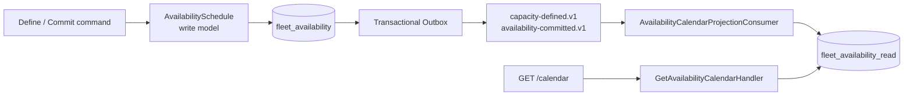

# CQRS Availability Calendar

Bu milestone, CQRS'yi “iki veritabanı kurmak” veya “MediatR eklemek” olarak
değil, aynı iş gerçeği için farklı amaçlara sahip iki model kullanmak olarak
uygular.

## Problem

`AvailabilitySchedule` aggregate'i şu komutu güvenli biçimde cevaplamak için
tasarlandı:

> Bu dönem ve miktar için, mevcut taahhütleri bozmadan yeni bir commitment
> kabul edilebilir mi?

Bu karar modeli bütün commitment'ları yükler, çakışan dönemlerdeki en yüksek
eşzamanlı kullanımı hesaplar ve overbooking invariant'ını aynı transaction
içinde korur. Fakat kullanıcı arayüzünün istediği soru farklıdır:

> Belirli kategori ve lokasyonda, önümüzdeki 30 günün her birinde toplam,
> taahhüt edilmiş ve müsait miktar nedir?

Takvim sorgusu için aggregate'i yükleyip her gün aynı domain hesabını tekrar
çalıştırmak sorgu maliyetini commitment sayısına bağlar, persistence modelini
API yanıtına sızdırır ve karar modeliyle sunum modelini aynı şekle zorlar.

## Seçilen model



| Model | Amaç | Saklama şekli | Tutarlılık |
|---|---|---|---|
| `AvailabilitySchedule` | Yeni commitment'ın kabul edilip edilemeyeceğine karar vermek | Aggregate + commitment'lar | Strong consistency |
| Availability Calendar | Gün bazında hızlı görüntüleme | Denormalize günlük satırlar | Eventual consistency |

Bu ayrım bir microservice sınırı değildir. İki model aynı bounded context,
uygulama ve PostgreSQL instance'ında çalışır; ayrı schema ve DbContext veri
sahipliğini ve bağımsız migration yaşam döngüsünü görünür kılar.

## Projection tabloları

`fleet_availability_read` schema'sı üç tablo içerir:

- `availability_schedules`: kategori/lokasyon için toplam kapasite;
- `availability_days`: `(schedule_id, date)` başına committed miktar;
- `inbox_messages`: consumer ve message id başına işlenmiş mesaj kaydı.

Gün satırında `available_quantity` saklanmaz. Sorguda
`total_capacity - committed_quantity` olarak hesaplanır. Böylece aynı türetilmiş
değer iki kolonda tutulup birbirinden kopamaz.

`availability_days` tablosundan schedule tablosuna bilinçli olarak foreign key
yoktur. Message transport farklı partition veya retry davranışları nedeniyle
commitment olayını capacity olayından önce teslim edebilir. Günlük delta önce
yazılabilir; capacity olayı geldiğinde takvim sorgulanabilir hâle gelir.

## Olay sözleşmeleri ve bağımlılık sınırı

Projection yalnızca Fleet Availability'nin yayımlanmış, sürümlü sözleşmelerini
tüketir:

- `fleet-availability.availability-capacity-defined.v1`
- `fleet-availability.equipment-availability-committed.v1`
- `fleet-availability.equipment-availability-released.v1`

Read model Domain, Application veya Infrastructure assembly'lerine referans
vermez. Bu sınır architecture test ile korunur. Böylece projection aggregate
nesnesini “kolaylık olsun” diye doğrudan okuyamaz.

Her event'in `EventId` değeri Outbox message id ile aynıdır. Consumer envelope
id ile payload id'nin eşleştiğini doğrular; bozuk bir mesaj sessizce
uygulanmaz.

## Idempotency ve atomiklik

Outbox at-least-once teslimat sağlar; aynı mesajın tekrar gelmesi hata değil,
beklenen davranıştır. Projection consumer tek local transaction içinde:

1. `(consumer, message_id)` Inbox kaydını kontrol eder;
2. daha önce görülmediyse projection değişikliğini uygular;
3. Inbox kaydını ekler;
4. ikisini birlikte commit eder.

Commitment, kapsadığı her tarih için PostgreSQL `INSERT ... ON CONFLICT DO
UPDATE` ile atomik delta uygular. Aynı event tekrar gelirse Inbox nedeniyle
delta ikinci kez uygulanmaz. Eşzamanlı duplicate teslimatta kaybeden transaction
unique conflict sonrası yeniden okuyup mesajın zaten işlendiğini görür.

## Sorgu davranışı

```http
GET /api/fleet-availability/calendar
    ?equipmentCategoryId={guid}
    &locationId={guid}
    &startDate=2030-08-10
    &endDateExclusive=2030-08-13
```

- Aralık half-open `[startDate, endDateExclusive)` biçimindedir.
- En az 1, en fazla 366 gün istenebilir.
- Capacity projection henüz yoksa `404 Not Found` döner.
- Commitment olmayan günler fiziksel satır gerektirmez; sorgu onları
  `committedQuantity = 0` olarak tamamlar.
- Sonuç her gün için total, committed ve available miktarı döndürür.

Komut başarıyla tamamlandıktan hemen sonra sorgunun eski state göstermesi
eventual consistency'nin doğal maliyetidir. İstemci kısa süreli retry/polling
uygulayabilir; karar gerektiren yeni bir commitment için read model'e
güvenilmez, daima aggregate çağrılır.

## Neden MediatR ve Event Sourcing yok?

CQRS, command ve query modellerini ayıran bir tasarım ilkesidir. MediatR bir
dispatch kütüphanesi, Event Sourcing ise state'i event geçmişinden kuran ayrı
bir persistence yaklaşımıdır. Hiçbiri CQRS'nin önkoşulu değildir.

Bu projede açık handler injection çağrı akışını görünür tutuyor. Write model
normal current-state tablolarında saklanıyor; Integration Event'ler entegrasyon
ve projection güncelleme amacı taşıyor, aggregate'in eksiksiz event-sourced
geçmişi değiller.

## Rebuild ve eksik olaylar

Projection türetilmiş veridir; gerektiğinde silinip yayımlanmış event'lerden
yeniden kurulabilmelidir. Mevcut in-process transport kalıcı event log değildir.
Production rebuild için Outbox retention süresi, broker replay kabiliyeti veya
ayrı projection checkpoint/rebuild aracı gerekir.

Commitment release artık ayrı bir iş olgusu olarak yayımlanır ve projection
günlük committed miktarını azaltır. Capacity değiştirme veya schedule
cancellation davranışı henüz yoktur. Bunlar eklendiğinde yeni, geriye uyumlu
event sözleşmeleriyle projection genişletilmelidir; read tablosuna doğrudan
düzeltme yazmak domain gerçeğini gizler.

## Kanıtlayan testler

`AvailabilityCalendarProjectionTests` gerçek PostgreSQL üzerinde şunları
kanıtlar:

1. Capacity ve commitment event'leri günlük takvimi oluşturur.
2. Aynı commitment event'i iki kez teslim edilse de miktar iki kez artmaz.
3. Commitment capacity'den önce gelse bile projection sonunda doğru olur.
4. Release event'i kapasiteyi geri getirir ve duplicate release güvenlidir.
5. Fleet Outbox'tan gerçek teslimat takvimi günceller ve mesajları processed
   olarak işaretler.
