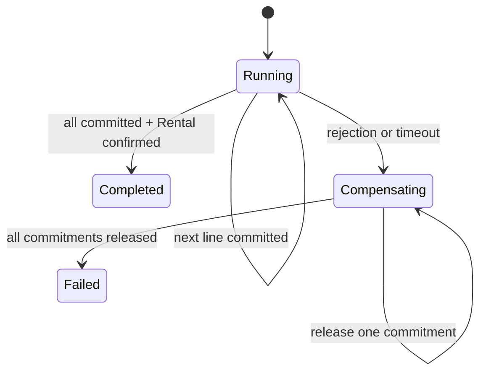

# Rental Confirmation Process Manager

## Why it is needed

A multi-line `RentalOrder` needs commitments from multiple
`AvailabilitySchedule` aggregates. Aggregate boundaries are strong-consistency
boundaries, so those schedules and the Rental Order must not share one domain
transaction. If an excavator commitment succeeds and a generator commitment
fails, the first commitment must be released. A stateless Application Service
can sequence calls but forgets progress after a crash.

## Responsibility

A Process Manager is a persisted coordinator for a long-running workflow
across aggregates or bounded contexts. It does not decide capacity or rental
invariants:

- Fleet Availability owns commit/release decisions.
- `RentalOrder` owns confirmation invariants.
- The Process Manager tracks the next step, completed work, and compensation.

## Compensation instead of rollback

Once a Fleet transaction commits, a later transaction cannot undo it through a
normal rollback. Distributed transactions would weaken context independence,
hold resources across calls, and hide partial failure. Instead,
`AvailabilitySchedule.Release` performs semantic undo: it records
`ReleasedAtUtc` and raises `EquipmentAvailabilityReleased`, preserving audit
meaning. Compensation can itself fail, so the process remains `Compensating`
and retries safely.

## Persisted state

The `rentals_process_manager` schema stores process state, deadline, failures,
attempts, worker lease, and one ordered step snapshot per Rental Line. A unique
process exists per Rental Order. Sequential or concurrent duplicate starts
return the same process. Steps use stable `RentalLineId` ordering, and
compensation releases them in reverse order.

## Crash-safe idempotency

- If Fleet commit succeeds before process state persists, retry uses
  `RentalLineId` as stable `DemandId` and returns the same commitment.
- If release succeeds first, a repeated release returns
  `WasAlreadyReleased = true`; removing it again from Rental is a no-op.
- If Rental confirmation succeeds first, reloading an already-confirmed order
  completes the process without raising a duplicate Domain Event.

This makes at-least-once execution safe; it does not claim exactly-once
transport.

## Worker claiming and timeout

Workers acquire time-limited `claimed_by`/`claimed_until_utc` leases guarded by
PostgreSQL `xmin`. Only one wins a concurrent claim; another resumes after an
expired lease. Each cycle persists one transition after its external effect.

The deadline is the earlier of five minutes after start and quote expiry. Once
expired, the process stops acquiring capacity and compensates existing
commitments. This is a business-process timeout, independent of HTTP lifetime.

## HTTP contract

`POST /api/rental-orders/{id}/confirmation` creates or returns the process with
`202 Accepted`; it does not claim immediate confirmation.
`GET /api/rental-orders/{id}/confirmation` exposes process, step, failure, and
retry state for polling until `Completed` or `Failed`. The old direct confirm
endpoint was removed to prevent bypassing orchestration.

## Why “Process Manager”

“Saga” can mean choreography or a compensating-transaction sequence. Process
Manager is more precise here: a central persisted state machine selects the
next command and owns timeout/compensation. It is neither a Domain Service
(no domain calculation) nor a stateless Application Service.

## Explicit boundaries

- Failed processes do not restart automatically; re-quote/restart is a
  separate business policy.
- Five technical failures move a process to `RequiresIntervention`; controlled
  resume/replay remains an operational capability to add.
- The current adapter is in-process, but the consumer-owned port permits a
  future HTTP/message transport.
- Status, `LastError`, metrics, and readiness expose failures; telemetry
  exporters remain deployment adapters.
