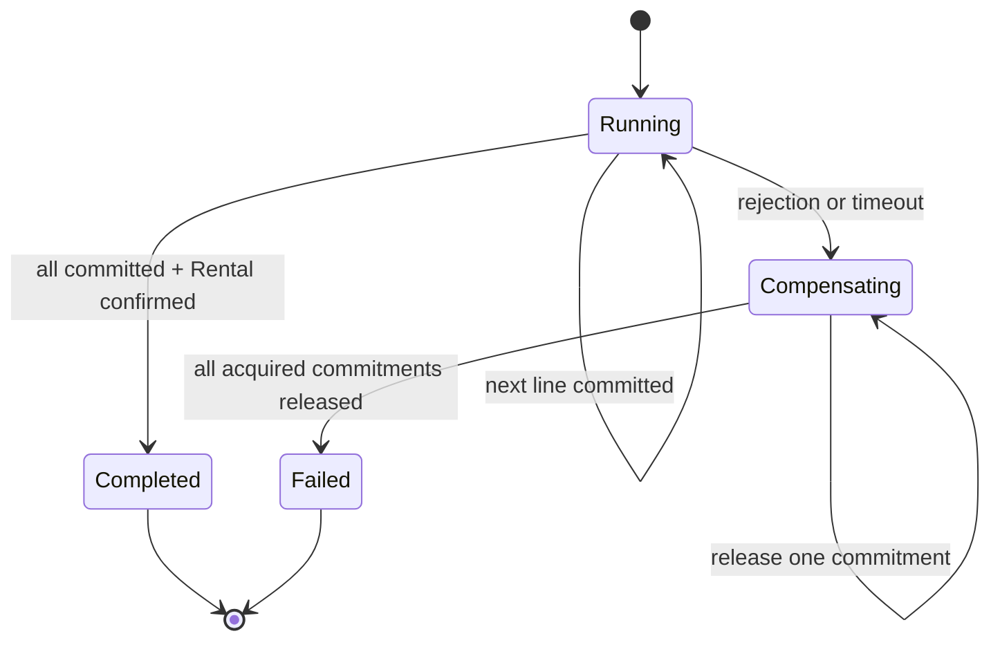

# Rental Confirmation Process Manager

## Neden gerekli?

Bir `RentalOrder` birden fazla ekipman kategorisi içerir. Her kategori farklı
bir `AvailabilitySchedule` aggregate'ine aittir. Aggregate sınırı aynı zamanda
strong-consistency sınırıdır; bu nedenle bütün schedule'ları ve RentalOrder'ı
tek bir domain transaction'ına almak doğru değildir.

Örnek:

1. Ekskavatör kapasitesi ayrıldı.
2. Jeneratör kapasitesi bulunamadı.
3. Rental henüz confirm edilemez.
4. İlk adımda ayrılan ekskavatör kapasitesi geri bırakılmalıdır.

Bir application service bu çağrıları tek metot içinde sırayla yapabilir fakat
process ortasında uygulama kapanırsa hangi adımın tamamlandığını unutabilir.
Process Manager'ın ayırt edici özelliği orkestrasyon state'ini kalıcı olarak
saklamasıdır.

## Process Manager nedir?

Process Manager, birden fazla aggregate veya bounded context'i kapsayan,
uzun süren iş akışının ilerlemesini yöneten stateful bir koordinatördür.
Kendisi kapasite veya kiralama invariant'ı kararı vermez:

- Fleet Availability, commitment kabul/release kararının sahibidir.
- RentalOrder, confirmation invariant'larının sahibidir.
- Process Manager yalnızca “hangi adım sırada, hangisi tamamlandı, başarısız
  olursak neyi telafi etmeliyiz?” sorularını cevaplar.



## Neden database rollback kullanmıyoruz?

Fleet commitment transaction'ı tamamlandıktan sonra başka bir aggregate'in
transaction'ı başlamaktadır. Commit edilmiş iş gerçeğini klasik database
rollback ile geri almak mümkün değildir. Distributed transaction kullanmak:

- context bağımsızlığını zedeler;
- gelecekte ayrı process/service olma seçeneğini zorlaştırır;
- ağ ve partial failure gerçeğini saklar;
- PostgreSQL transaction'ını dış çağrı boyunca açık tutmayı gerektirir.

Bunun yerine semantic undo, yani **compensating action** kullanılır.
`AvailabilitySchedule.Release` geçmiş commitment'ı silmez; `ReleasedAtUtc`
ile işaretler ve `EquipmentAvailabilityReleased` Domain Event'i üretir.
Böylece kapasite geri dönerken audit anlamı korunur.

Compensation teknik rollback ile aynı garantiye sahip değildir. Release çağrısı
da geçici olarak başarısız olabilir; Process Manager `Compensating` state'inde
kalır ve güvenli biçimde retry eder.

## Kalıcı process state

`rentals_process_manager` schema'sı:

- `rental_confirmation_processes`: process durumu, deadline, hata, attempt ve
  worker claim bilgisi;
- `rental_confirmation_steps`: her RentalLine için snapshot, sıra, commitment
  id ve step state;
- schema-local migration history.

Her rental order için unique process kaydı vardır. Aynı start komutu:

- sırayla tekrarlandığında mevcut process'i döndürür;
- iki instance tarafından eşzamanlı gönderildiğinde unique constraint
  kazananını döndürür;
- ikinci bir orkestrasyon başlatmaz.

Process adımları stable `RentalLineId` sırasıyla numaralanır. Compensation
commitment'ları ters sırada bırakır. Veritabanından gelen doğal satır sırasına
güvenilmez.

## Crash-safe idempotency

Cross-context iki işlem arasında kaçınılmaz crash pencereleri vardır.

### Commit başarılı, process state yazılamadı

Fleet, `RentalLineId` değerini opaque `DemandId` olarak kullanır. Aynı commit
tekrarlandığında aynı commitment id döner ve ikinci kapasite düşümü oluşmaz.
RentalOrder da aynı commitment id'nin tekrar kaydını no-op kabul eder.

### Release başarılı, process state yazılamadı

Commitment satırı silinmediği için Fleet tekrar release çağrısında aynı
commitment'ı `WasAlreadyReleased = true` ile döndürür. RentalOrder'dan aynı
commitment'ı ikinci kez temizlemek de no-op'tur.

### Rental confirm oldu, process tamamlanamadı

Worker RentalOrder'ı yeniden yükler. State zaten `Confirmed` ise ikinci Domain
Event üretmeden process'i `Completed` yapar.

Bu teknikler exactly-once transport iddiasında bulunmaz. At-least-once işlemeyi
idempotent business operasyonlarıyla güvenli hâle getirir.

## Worker claim ve concurrency

Background worker her aktif process için süreli bir lease alır:

- `claimed_by`
- `claimed_until_utc`
- PostgreSQL `xmin`

İki worker aynı state'i okursa optimistic concurrency nedeniyle yalnızca biri
claim'i kazanır. Worker ölürse lease süresi dolduğunda başka worker devam eder.
Her çevrim yalnızca bir state transition yapar; böylece ilerleme her dış etki
sonrasında kalıcı hâle gelir.

## Timeout

Deadline, process başlangıcından beş dakika sonrası ile quote expiry
zamanlarından erken olanıdır. Deadline aşılırsa yeni commitment denenmez;
process `Compensating` state'ine geçer ve daha önce elde edilen commitment'ları
release eder.

Bu bir HTTP request timeout'u değildir. Kullanıcı bağlantısı kapanmış olsa bile
kalıcı business process arka planda ilerlemeye devam eder.

## HTTP sözleşmesi

```http
POST /api/rental-orders/{rentalOrderId}/confirmation
```

Komut process'i yaratır ve `202 Accepted` döndürür. `202`, RentalOrder'ın o anda
confirm edildiği anlamına gelmez; işin kabul edildiğini ifade eder.

```http
GET /api/rental-orders/{rentalOrderId}/confirmation
```

Process, step, failure ve retry durumunu döndürür. İstemci terminal state olan
`Completed` veya `Failed` görülene kadar polling yapabilir.

Eski doğrudan `/confirm` endpoint'i kaldırılmıştır; aksi hâlde orchestration
sınırı kolayca bypass edilebilirdi.

## Process Manager, Saga ve Domain Service

“Saga” terimi literatürde hem event koreografisi hem de compensating
transaction dizisi için kullanılır. Bu projede daha kesin olan **Process
Manager** adı seçildi çünkü:

- merkezi ve kalıcı bir state machine vardır;
- sıradaki komutu kendisi seçer;
- timeout ve compensation'ı kendisi yönetir.

Domain Service değildir; domain hesaplaması yapmaz. Stateless application
service de değildir; process ilerlemesini restart sonrasında hatırlamak
zorundadır.

## Bilinçli sınırlar

- Aynı failed process otomatik olarak yeni baştan açılmaz. Re-quote/restart
  politikası ayrı bir business kararıdır.
- Beş teknik hatadan sonra process `RequiresIntervention` olur; kontrollü
  resume/replay komutu ve operatör runbook'u henüz yoktur.
- In-process adapter kullanılır; port sınırı gelecekteki HTTP/message
  transport'una açıktır.
- Process status endpoint'i, `LastError`, runtime metric ve readiness
  degradation üretir; harici telemetry exporter deployment adapter'ıdır.
