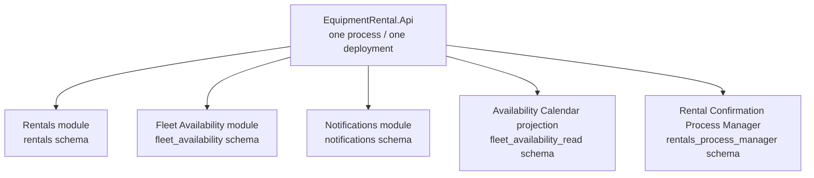

# Service Extraction Assessment

## Decision

**As of July 31, 2026, no bounded context will be extracted into an independent
service.** The system remains a modular monolith.

This does not mean extraction is impossible. Existing code boundaries preserve
the option to separate selected modules later. What is missing today is
production evidence that justifies the added process, network, broker,
independent deployment, and distributed-operations costs.

Two different kinds of candidacy are worth distinguishing:

- **Notifications** is the lowest-risk technical extraction pilot. Its flow is
  asynchronous, it owns its data, and it consumes only a published Rentals
  event contract.
- **Fleet Availability** is the strongest operational candidate if independent
  scaling or write contention emerges. Its current commit/release conversation
  with Rentals is synchronous and in-process, so extraction would introduce a
  real network-failure model.

Neither observation is an extraction decision. They identify where to look
first if measurable drivers appear.

## Bounded Context, module, and service are different boundaries

```text
Bounded Context = semantic boundary of a model and its Ubiquitous Language
Module          = physical protection of that boundary in one codebase/process
Service         = independent process and deployment boundary
```

A bounded context can be implemented completely inside a modular monolith. A
service can also be poorly designed and mix several contexts. DDD does not
require one microservice per bounded context.

Current topology:



Availability Calendar is a CQRS read model derived from Fleet Availability
facts, not a separate bounded context. The Process Manager is an orchestration
component for Rentals' cross-context confirmation process, not a new context.

## Evidence classes

| Class | Meaning | Example in this repository |
| --- | --- | --- |
| Verified structural evidence | Directly observable in code and tests | Separate schemas, Contracts assemblies, dependency rules |
| Domain hypothesis | Expected from the business model but not measured | Potential Fleet write contention |
| Operational evidence | Live traffic, incident, and deployment data | Not available yet |

Hypotheses are not presented as measurements. With no production traffic, the
repository does not invent latency percentiles, CPU ratios, incident counts, or
team-delivery constraints.

## Evaluation criteria

A context becomes a service candidate when independent deployment is needed
for one or more measured drivers:

1. **Independent scaling:** materially different CPU, memory, throughput, or
   concurrency behavior.
2. **Failure isolation:** one module repeatedly harms another capability's SLO.
3. **Independent delivery cadence:** a shared release repeatedly blocks teams.
4. **Team ownership:** a stable autonomous team owns the context end to end.
5. **Security or compliance:** process, network, or data isolation is required.
6. **Technology fit:** evidence shows the workload needs a different runtime or
   storage model.

The following are not sufficient on their own:

- a context has a separate name, folder, or schema;
- microservices are popular;
- the system might grow one day; or
- deployment count is treated as architectural maturity.

## Current assessment

| Context or model | Structural separability | Operational driver | Distributed cost | Decision today |
| --- | --- | --- | --- | --- |
| Rentals | Medium | Not measured | High: central workflow and Process Manager | Keep in monolith |
| Fleet Availability | High | Contention/scaling are hypotheses | Medium/high: synchronous commit/release becomes remote | Preserve option and measure |
| Notifications | High | Backlog/channel scaling not measured | Medium: requires broker operations | Candidate pilot, do not extract |
| Availability Calendar | Technically high | Read load not measured | Medium: transport and freshness SLO | Keep as Fleet read model |
| Confirmation Process Manager | Low | Separate worker scale not measured | High: close to Rentals transitions | Keep with Rentals |

### Rentals

Verified evidence:

- owns the Core Domain behavior and commercial lifecycle;
- owns its Aggregates, application ports, schema, and Outbox;
- never references Fleet internals; and
- coordinates multi-line confirmation through its Process Manager.

It remains in-process because the primary workflow is Rentals-centric and
there is no team, security, scaling, or delivery evidence that offsets remote
coordination costs.

### Fleet Availability

Verified evidence:

- owns its Domain Model, Aggregate, Application layer, and schema;
- publishes primitive, versioned contracts;
- is consumed through a Rentals-owned port and Anti-Corruption Layer;
- publishes events through an Outbox to an idempotent projection; and
- is protected from internal coupling by architecture tests.

It is a plausible candidate because capacity writes may develop a different
concurrency profile. It is not extracted now because that profile has not been
measured. Moving commit/release calls across a network introduces timeouts,
ambiguous outcomes, retries, and circuit breaking without improving the
overbooking invariant, which still belongs in a Fleet Aggregate transaction.

### Notifications

Verified evidence:

- is a Supporting Subdomain consuming only
  `rental-order-confirmed.v1`;
- has no application dependency on another business module;
- writes Inbox and notification work in one local transaction; and
- owns its schema.

It is a lower-risk pilot because the producer expects no synchronous response
and eventual consistency is explicit. It remains in-process because there is
no broker operation, backlog evidence, separate availability target, or
volume that justifies an extra deployment.

## Decision thresholds

At least one **hard driver** must be observed over 30 representative days or
three consecutive releases. Crossing a threshold starts a decision process; it
does not automatically order extraction.

| Driver | Signal | Initial threshold |
| --- | --- | --- |
| Independent scaling | Context CPU, memory, throughput, saturation | One context continuously consumes 40%+ of host resources and needs different scale-out |
| Fleet contention | Optimistic conflicts and exhausted retries | 1%+ conflict rate at meaningful traffic or post-retry SLO breach |
| Failure isolation | Context-caused incidents and affected endpoints | Two incidents in 30 days harm another capability's SLO |
| Deployment independence | Blocked or cancelled changes | Contexts block each other for three release periods |
| Notifications backlog | Oldest pending age and queue depth | Delivery target fails in two windows and scaling the host is uneconomical |
| Security/compliance | Approved risk or regulation | Separate process, network, or data isolation becomes mandatory |
| Team autonomy | Ownership and on-call boundary | A stable team owns an independent SLO and release lifecycle |

Before extracting, test cheaper options: query/index tuning, worker concurrency,
an in-process bulkhead, cache/read replicas, Aggregate partitioning, a separate
worker for the same context, or pipeline improvements.

## Extraction readiness checklist

- [ ] The problem is tied to measured dashboard, incident, or release data.
- [ ] A context owner and on-call responsibility exist.
- [ ] An independent SLO and capacity plan are defined.
- [ ] Synchronous and asynchronous contracts are versioned.
- [ ] Idempotency, timeout, and ambiguous-result semantics are explicit.
- [ ] Data has one write owner and no dual write.
- [ ] Migration, cutover, and rollback have been rehearsed.
- [ ] Distributed tracing and correlation cross both processes.
- [ ] Service identity, security, and secret rotation are solved.
- [ ] Expected business value exceeds operational cost.

## Fitness functions

`ServiceExtractionFitnessTests` preserve optionality by verifying that:

- a business module can reference another module only through `.Contracts`;
- business modules cannot depend on the API composition root; and
- published contract assemblies cannot depend on ASP.NET Core, EF Core, or
  Npgsql.

These tests do not claim the system is a microservice architecture. They stop
modular-monolith erosion from closing future options.

## Related documents

- [Service Extraction Playbook](service-extraction-playbook.md)
- [Context Map](../discovery/05-context-map.md)
- [ADR-0001 — Start with a Modular Monolith](../decisions/0001-start-with-a-modular-monolith.md)
- [ADR-0014 — Do Not Extract Services without Measured Drivers](../decisions/0014-no-service-extraction-without-measured-drivers.md)
