# Big Picture Event Storming

This is the first modeling hypothesis. It is deliberately expected to change
after conversations with domain experts.

## Main timeline

Domain events are written in past tense because they describe facts that have
already happened.

```mermaid
flowchart LR
    A["Quote Requested"] --> B["Quote Priced"]
    B --> C["Quote Accepted"]
    C --> D["Availability Requested"]
    D --> E{"Available?"}
    E -->|Yes| F["Equipment Reserved"]
    E -->|No| G["Availability Rejected"]
    F --> H["Rental Confirmed"]
    H --> I["Delivery Scheduled"]
    I --> J["Equipment Delivered"]
    J --> K["Rental Started"]
    K --> L["Equipment Returned"]
    L --> M["Return Inspected"]
    M --> N["Invoice Issued"]
    N --> O["Payment Recorded"]
    O --> P["Rental Closed"]
```

## Commands, events, policies, and read models

| Command | Decider | Resulting event | Important policy/invariant |
|---|---|---|---|
| Request quote | Rental agent | Quote Requested | Customer and requested period must be known |
| Price quote | Pricing policy | Quote Priced | Every amount has a currency and pricing basis |
| Accept quote | Customer/rental agent | Quote Accepted | Quote must still be valid |
| Request availability | Rentals process | Availability Requested | Request uses accepted period, fulfilment location, and equipment requirements |
| Commit equipment | Availability planner/system | Equipment Reserved | Commitments cannot overlap; maintenance quarantine wins |
| Confirm rental | Rental order | Rental Confirmed | Every order line has a matching active commitment |
| Schedule delivery | Dispatcher | Delivery Scheduled | Site and time window must be serviceable |
| Record handover | Yard operator | Equipment Delivered | Identity, condition, accessories, and meter are recorded |
| Start rental | Rental process | Rental Started | Equipment must have been handed over |
| Request extension | Customer/rental agent | Extension Requested | Existing terms remain valid until approved |
| Approve extension | Availability + Rentals | Rental Extended | New period must not conflict with later commitments |
| Record return | Yard operator | Equipment Returned | Actual return time and meter reading are required |
| Inspect return | Inspector | Return Inspected | Condition is recorded independently of billing |
| Calculate charges | Billing | Charges Calculated | Accepted rates and observed usage are both preserved |
| Issue invoice | Billing | Invoice Issued | Charge set must be complete and auditable |

## Policies

Policies react to facts and may issue commands:

- When a quote is accepted, request availability.
- When all equipment is reserved, confirm the rental.
- When availability is rejected, keep the rental unconfirmed and notify the
  rental agent.
- When equipment is returned, request inspection.
- When damage is detected, open a damage assessment; do not directly decide the
  final charge.
- When inspection marks equipment unsafe, quarantine it in Maintenance and
  withdraw future availability.
- When billing is complete and all equipment is accounted for, close the rental.

## Read models

- Equipment availability calendar
- Rental order summary
- Dispatch board
- Active rentals dashboard
- Return inspection queue
- Invoice explanation
- Equipment history

Read models are user questions, not aggregate replicas. Their shape may combine
data from multiple contexts.

## External systems

- Identity provider
- Payment service provider
- Tax calculation service
- Maps/routing provider
- Email/SMS provider

Each external model will be translated at an anticorruption boundary when its
language does not match ours.

## Hotspots and unanswered domain questions

Hotspots are intentionally not resolved by technical assumptions:

1. Is availability committed to a specific asset or to an equipment category?
2. Can one requested line be fulfilled by multiple substitute models?
3. At what point does a quoted price become contractually fixed?
4. Is a partial confirmation allowed?
5. Which timezone defines a rental period spanning locations?
6. Does a late return automatically extend a rental or create a separate charge?
7. Can emergency maintenance break an existing future commitment?
8. Who can override an availability conflict, and how is the decision audited?
9. Are deposits, credit limits, and payment authorization prerequisites for
   confirmation?
10. When is a returned asset considered available again: physical return or
    completed inspection?

These questions will drive model discovery. They must not become booleans with
ambiguous names.
