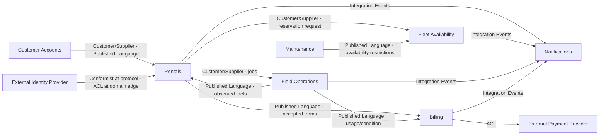

# Context Map

## Map

## Relationship explanations

### Customer Accounts → Rentals

Customer Accounts is upstream for customer identity and eligibility. It exposes
a small published contract. Rentals stores the customer identifier and the
commercial facts it needs; it does not share the upstream customer entity.

### Rentals → Fleet Availability

Rentals asks for a commitment using category, location, and period.
Fleet Availability owns the decision and returns its own commitment identifier.
Rentals must not infer availability from asset tables.

### Maintenance → Fleet Availability

Maintenance publishes restrictions such as quarantine and planned service.
Fleet Availability translates these into capacity effects. Maintenance does not
edit reservations directly.

### Rentals → Field Operations

A confirmed rental requests delivery/collection jobs. Field Operations owns
dispatch and execution. Its observations are facts, not direct mutations of a
rental aggregate.

### Rentals and Field Operations → Billing

Rentals publishes accepted commercial terms; Field Operations publishes
observed delivery, return, meter, and condition facts. Billing combines these
within its own charge model.

### Billing → Payment provider

The provider's authorization, capture, settlement, and refund model is kept
behind an anticorruption layer. Provider-specific statuses do not enter the
Billing domain.

### Rentals → Notifications

Rentals publishes a confirmed rental through a versioned Published Language.
Notifications conforms to that contract without depending on the Rentals
Domain model; its Infrastructure adapter translates the event into the local
`RequestRentalConfirmationNotification` command.

Notifications is a supporting subdomain. Its current rule is simple, so it
uses a Transaction Script rather than a rich Domain Model. An Inbox makes
repeated delivery of the same event idempotent.

## Data ownership rules

- A module writes only its own tables/schema.
- Cross-context reads use contracts or purpose-built read models.
- No shared domain entity assembly exists.
- Shared technical primitives must be smaller than the domain and contain no
  business vocabulary.
- Integration contracts are versioned independently of internal domain events.
