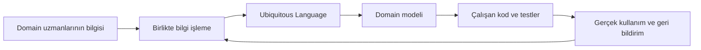

# 02 — Eric Evans'ın Blue Book'u

## Kaynak ve tarihsel önemi

Eric Evans'ın 2003 yılında yayımlanan *Domain-Driven Design: Tackling
Complexity in the Heart of Software* kitabı, kapağının renginden dolayı
**Blue Book** olarak anılır.

Evans bütün yapı taşlarını sıfırdan icat etmiş değildir. Nesne yönelimli
modelleme, analysis patterns, design patterns, layered architecture,
refactoring ve çevik geliştirme gibi daha eski düşünceleri; karmaşık iş
alanlarına odaklanan tutarlı bir yaklaşım ve ortak sözlük altında bir araya
getirmiştir. DDD'yi tarihsel olarak doğru anlamak için:

- “Eric Evans her deseni icat etti” demek fazla geniştir.
- “Evans yalnızca yeni isimler verdi” demek ise katkısını küçümser.
- Esas katkı, **domain bilgisini keşfetme, modelleme, kodla bağlama ve büyük
  ölçekte sınırlandırma pratiklerini tek bir düşünce sistemi hâline
  getirmesidir**.

İncelenen PDF 324 fiziksel sayfadır. Belge, kitabın 17 bölümünü, sonuç,
pattern eki, sözlük ve kaynakçayı içerir. PDF fiziksel sayfaları basılı kitabın
sayfa numaralarıyla bire bir örtüşmediğinden başlıklar esas alınmalıdır.

## Blue Book'un cevaplamaya çalıştığı problem

Karmaşık iş yazılımında iki ayrı başarısızlık sık görülür:

1. Analistler gerçeğe benzeyen kapsamlı bir model üretir, fakat model
   uygulanabilir değildir.
2. Geliştiriciler çalışan kod üretir, fakat kod iş alanına ilişkin bilgiyi ve
   anlamı taşımaz.

İlkinde “doğru görünen ama işe yaramayan analiz modeli”, ikincisinde “çalışan
ama neden çalıştığı anlaşılamayan teknik model” vardır.

Evans'ın önerisi **Model-Driven Design**'dır:

- Analiz için başka, kod için başka bir model kullanılmamalıdır.
- Model, çözmek istediğimiz problem için seçilmiş bir soyutlamadır; gerçek
  dünyanın eksiksiz kopyası değildir.
- Kodun domain ile ilgili bölümü modeli ifade etmelidir.
- Modeldeki yeni içgörü koda, koddaki tasarım baskısı da modele geri
  yansımalıdır.

Dolayısıyla DDD'nin özündeki döngü şöyledir:

Bu bir gereksinim toplama aşaması değildir. Yazılım yaşadığı sürece devam eden
bir öğrenme ve model iyileştirme döngüsüdür.

## Kitabın dört ana kısmı

## I — Domain modelini işe koşmak

### 1. Crunching Knowledge

Evans'ın kullandığı “knowledge crunching”, domain uzmanının geliştiriciye
gereksinim listesi teslim etmesi değildir. Geliştiriciler ve uzmanlar:

- senaryoları birlikte yürütür;
- terimleri düzeltir;
- çelişkileri bulur;
- farklı model seçeneklerini dener;
- çalışan yazılımdan yeni bilgi çıkarır.

Geliştiricinin domain uzmanı olması gerekmez; fakat domain hakkında model
kurabilecek kadar öğrenmesi gerekir. Domain uzmanının da yazılım tasarlaması
beklenmez. Model, iki uzmanlık alanının işbirliğiyle oluşur.

### 2. Communication and the Use of Language

**Ubiquitous Language**, modelin kavramlarına dayanan takım dilidir. Yalnızca
bir sözlük değildir:

- terimler;
- fiiller ve davranışlar;
- kurallar ve kısıtlar;
- önemli senaryolar;
- kavramlar arası ilişkiler

dilin parçasıdır.

Dil toplantıda başka, dokümanda başka, kodda başka olursa sürekli çeviri
yapılır. Her çeviri bilgi kaybı ve farklı model oluşturma riskidir. İyi model,
domain uzmanının konuşabildiği ve geliştiricinin doğrudan koda taşıyabildiği
modeldir.

### 3. Binding Model and Implementation

**Model-Driven Design**, model ile uygulamanın birbirine bağlı kalmasını ister.
Kod, modelin yalnızca teknik bir çıktısı değildir; modelin yürütülebilir
ifadesidir.

Bu nedenle:

- yalnızca diyagram çizen “modelleyici” ile yalnızca kodlayan geliştirici
  ayrılığı zararlıdır;
- kod yazan kişiler model tartışmalarına katılmalıdır;
- uygulanamayan bir model yeterince iyi değildir;
- modelle açıklanamayan kod, domain bilgisini gizliyor olabilir.

## II — Model-Driven Design'ın yapı taşları

### 4. Isolating the Domain

Domain kodu; kullanıcı arayüzü, veritabanı, mesajlaşma ve framework
ayrıntılarından ayrılmalıdır. Evans burada klasik **Layered Architecture**'ı ele
alır:

1. User Interface
2. Application
3. Domain
4. Infrastructure

Katmanların temel görevleri:

- **UI:** Kullanıcıya bilgi gösterir ve girdiyi alır.
- **Application:** Bir kullanım senaryosunu koordine eder. İş kuralının sahibi
  değildir.
- **Domain:** İş kavramları, davranışlar ve invariants burada yaşar.
- **Infrastructure:** Kalıcılık, mesajlaşma ve teknik mekanizmaları sağlar.

Kitaptaki mimari, günümüzdeki Clean Architecture'ın bire bir aynısı değildir.
Ports and Adapters, Clean Architecture ve Onion Architecture benzer bir
izolasyon amacını farklı bağımlılık kurallarıyla geliştirir.

Evans ayrıca önemli bir pragmatik istisna sunar: **Smart UI**. İş mantığı basit,
ekip küçük ve değişim beklentisi sınırlıysa zengin domain modeli kurmak
gereksiz olabilir. Bu, Blue Book'un bile “her yerde DDD” önermediğini gösterir.

### 5. A Model Expressed in Software

#### Entity

Entity'yi nitelikleri değil, süreklilik gösteren kimliği tanımlar. Aynı kişinin
adı veya adresi değişebilir; fakat sistem açısından aynı kişi olmaya devam eder.

Her veritabanı satırı otomatik olarak domain entity değildir. Kimliğin iş
açısından anlamlı bir yaşam döngüsü varsa entity modeli gerekir.

#### Value Object

Value Object kimliğiyle değil, değerlerinin bütünüyle tanımlanır.

Örneğin `Money(100, TRY)` başka bir `Money(100, TRY)` ile eşittir. Genellikle:

- immutable tasarlanır;
- kendi doğrulamasını yapar;
- geçersiz durumda oluşturulamaz;
- domain'e özgü davranış taşır.

Value Object yalnızca “primitive obsession azaltma tekniği” değildir; domain
dilindeki bir kavramı açıkça ifade eder.

#### Service

Bir davranış Entity veya Value Object'e doğal biçimde ait değilse domain
service olabilir. İyi bir domain service:

- domain dilinde adlandırılır;
- önemli bir iş operasyonunu temsil eder;
- mümkün olduğunca stateless'tir.

Her şeyi `XService` sınıflarına koymak anemic domain model üretir. Önce
davranışın bir nesneye ait olup olmadığı sorgulanmalıdır.

#### Module

Module yalnızca teknik klasör değildir. Modelin kavramsal parçalarını yüksek
cohesion ve düşük coupling ile anlatmalı, adı ubiquitous language'dan
gelmelidir.

### 6. The Life Cycle of a Domain Object

#### Aggregate

Aggregate, birlikte değişen nesneler için **tutarlılık ve transaction
sınırıdır**.

Kuralları:

- Dış dünya yalnızca Aggregate Root'u referans alır.
- İç nesneler root üzerinden değiştirilir.
- Aggregate tamamlandığında bütün invariants doğru olmalıdır.
- Bir transaction mümkün olduğunca tek aggregate'i değiştirir.
- Aggregate dışındaki nesneler kimlikleriyle referanslanır.

Blue Book örneklerinde aggregate'ler bazen bugünkü pratiklere göre büyük
yorumlanmıştır. Modern dağıtık sistemlerde küçük aggregate ve eventual
consistency daha fazla vurgulanır; fakat esas tanım değişmez: aggregate bir
nesne grafiği değil, consistency boundary'dir.

#### Factory

Karmaşık oluşturma sürecini, oluşturulan nesnenin invariants'ını bozmayacak
biçimde kapsüller. Basit nesne için factory kullanmak gereksizdir; constructor
veya anlamlı bir static factory yeterli olabilir.

#### Repository

Domain açısından aggregate'lere koleksiyon benzeri erişim sağlar ve kalıcılık
mekanizmasını gizler.

- Repository aggregate root içindir.
- Her tabloya repository açılmaz.
- Transaction'ı çoğunlukla repository değil application/use case sınırı
  yönetir.
- Genel amaçlı `IRepository<TEntity>` domain'e özgü sorguları ve dili
  zayıflatabilir.

### 7. Extended Example

Blue Book'un birleşik örneği **kargo taşımacılığı sistemidir**:

- yük rezervasyonu;
- taşıma hareketlerinin takibi;
- teslimat sürecine göre otomatik faturalama

üzerinden Entity, Value Object, Aggregate, Factory, Repository, Module ve
Layered Architecture birlikte ele alınır.

Bu nedenle kendi öğretici projemizde aynı domain'i kullanmak kavramları başka
bir alana transfer edip edemediğimizi göstermeyecektir.

## III — Daha derin içgörüye doğru refactoring

Blue Book'u yalnızca “taktiksel desenler kitabı” gibi okumak, üçüncü kısmı
kaçırmaktır.

### Breakthrough

Model gelişimi doğrusal değildir. Küçük refactoring'ler zaman zaman iş alanını
çok daha sade açıklayan bir **deep model** buluşuna hazırlar. Yeni model:

- daha az kavramla daha çok şeyi açıklayabilir;
- yeni talepleri daha doğal karşılar;
- daha önce tesadüfi görünen kuralları tek bir fikir altında birleştirir.

Bu bir kerelik “analiz tamamlandı” anı değil, ürün yaşamı boyunca ortaya
çıkabilecek bir sıçramadır.

### Making Implicit Concepts Explicit

Konuşmada sürekli tarif edilen ama adı konmamış kavramlar aranır:

- açıkça söylenmeyen kısıt;
- gizli bir iş politikası;
- süreç içindeki önemli durum;
- aslında ayrı kavramlar olan iki benzer terim;
- aslında tek kavram olan dağınık davranışlar.

Bir kavrama isim vermek, onu modelde tartışılabilir ve değiştirilebilir hâle
getirir.

### Supple Design

Derin bir model yetmez; modelin geliştirici tarafından güvenle değiştirilebilir
olması gerekir. Evans'ın başlıca ilkeleri:

- **Intention-Revealing Interface**
- **Side-Effect-Free Function**
- **Assertion**
- **Conceptual Contour**
- **Standalone Class**
- **Closure of Operations**

Amaç desen kullanma gösterisi değil, kodun ne yaptığını ve neyi değiştirdiğini
öngörülebilir kılmaktır.

### Analysis Patterns ve Design Patterns

Geçmiş çözümler başlangıç hipotezi sağlayabilir; hazır cevap değildir. Bir
pattern:

- yeni domain'e zorla uygulanmaz;
- ubiquitous language'ın yerine geçmez;
- önceki tasarımın yüzeyini değil, arkasındaki problemi öğretir.

### Refactoring Toward Deeper Insight

Evans bu süreci üç davranışla özetler:

1. Domain'in içinde yaşa.
2. Probleme sürekli farklı açılardan bak.
3. Domain uzmanlarıyla kesintisiz diyaloğu koru.

Refactoring yalnızca metot ayırmak veya duplication silmek değildir. Kavramı,
ismi, sorumluluğu ve sınırı değiştiren **model refactoring** de yapılır.

## IV — Strategic Design

### Maintaining Model Integrity

Tek ve kurumsal ölçekte evrensel bir model kurmaya çalışmak çelişen anlamları
birbirine karıştırır.

#### Bounded Context

Bir modelin tutarlı ve geçerli olduğu açık sınırdır. Sınır:

- dilsel;
- kavramsal;
- kod ve veri sahipliğiyle ilgili;
- takım ve yaşam döngüsüyle ilgili

olabilir.

#### Continuous Integration

Blue Book'taki Continuous Integration yalnızca CI pipeline değildir. Aynı
bounded context üzerinde çalışan kişilerin model parçalarının ayrışmasını
önleyecek sıklıkta kodu, dili ve modeli birleştirmesidir.

#### Context Map

Mevcut model sınırlarını ve aralarındaki ilişkileri görünür kılar. İdeal geleceği
çizmeden önce mevcut gerçekliği dürüstçe göstermelidir.

İlişki desenleri:

- Shared Kernel
- Customer/Supplier
- Conformist
- Anticorruption Layer
- Separate Ways
- Open Host Service
- Published Language

Bu desenler API formatından önce takım ilişkisi, değişim kontrolü ve model
çevirisi hakkındadır.

### Distillation

Sistemdeki her şey eşit stratejik değerde değildir.

#### Core Domain

Yazılımın işletmeye farklılık ve değer sağlayan özüdür. En iyi insanlar ve
tasarım emeği burada kullanılmalıdır.

#### Generic Subdomain

Rekabet avantajı sağlamayan ve genel çözümü bulunan alandır. Satın alma,
hazır ürün veya basit uygulama değerlendirilir.

#### Domain Vision Statement

Core domain'in neden değerli olduğunu kısa ve teknik olmayan biçimde açıklar.

#### Highlighted/Segregated/Abstract Core

Core'un görünürlüğünü artırmak için dokümantasyon ve model ayrıştırma
stratejileridir. Amaç, değerli modeli destekleyici ayrıntılar arasında
kaybetmemektir.

Khononov'un modern sınıflandırmasındaki **supporting subdomain**, Blue Book'un
generic/core ayrımını daha operasyonel hâle getiren önemli bir açıklamadır.

### Large-Scale Structure

Çok büyük bir modelde geliştirici parçaların bütün içindeki rolünü göremeyebilir.
Evans; Evolving Order, System Metaphor, Responsibility Layers, Knowledge Level
ve Pluggable Component Framework gibi üst ölçekli düzenleme desenlerini
inceler.

Bu yapı mümkün olduğunca az ve evrilebilir kural içermelidir. Fazla kapsamlı
upfront architecture, modelin öğrenmeyle değişmesini engelleyen bir kafese
dönüşebilir.

### Bringing the Strategy Together

Stratejik tasarım üç tamamlayıcı alandır:

1. **Context:** Her model nerede geçerli?
2. **Distillation:** Hangi bölüm gerçekten stratejik değer taşıyor?
3. **Large-scale structure:** Büyük resim nasıl anlaşılır kalacak?

Başlangıç değerlendirmesi için:

- mevcut context map'i çiz;
- kullanılan dili dinle;
- core domain'i tanımla;
- teknik yapının modeli destekleyip desteklemediğini incele;
- kararların evrimine izin ver.

## Blue Book'un kapsamadığı modern başlıklar

Kitap 2003 bağlamında yazılmıştır. Bu nedenle aşağıdaki güncel pratikleri merkezî
desenler olarak ele almaz:

- Domain Event ve Integration Event ayrımı
- Event Sourcing
- CQRS
- Transactional Outbox
- Saga ve Process Manager'ın modern kullanımı
- Microservices deployment kararları
- Event Storming
- Cloud-native gözlemlenebilirlik

Bu bir eksiklikten çok tarihsel kapsam farkıdır. Bu başlıkları Blue Book'un
ilkelerinin yerine değil, onların üzerine inşa edilen modern araçlar olarak
okuyacağız.

## Blue Book'tan çıkarılan çalışma ilkeleri

1. DDD'nin başlangıç noktası sınıf tasarımı değil, knowledge crunching'dir.
2. Model gerçekliğin kopyası değil, belirli bir problemi çözen seçici
   soyutlamadır.
3. Ubiquitous language bir doküman değil, yaşayan takım davranışıdır.
4. Kodlayan geliştirici aynı zamanda modelleyicidir.
5. Aggregate kalıcılık veya nesne grafiği değil, tutarlılık sınırıdır.
6. Repository her entity veya tablo için oluşturulmaz.
7. Model, sürekli refactoring ile daha derin içgörüye evrilir.
8. Tek enterprise model yerine açık bounded context'ler kullanılır.
9. En iyi tasarım emeği core domain'e ayrılır.
10. Başarı, desen sayısıyla değil, yazılımın yıllar içinde işletmeye sağladığı
    değerle ölçülür.
