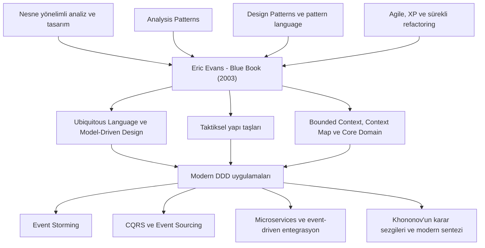

# 03 — DDD'nin tarihsel ve bütünsel okuma rehberi

## DDD birikiminin tarihsel katmanları

DDD tek bir günde ortaya çıkan bağımsız bir icat değildir. Düşünsel gelişimi
kabaca şöyle okunabilir:

Eric Evans'ın katkısı, önceki pratikleri domain karmaşıklığının kalbine
yerleştirip birbirini destekleyen bir yöntem ve pattern language hâline
getirmesidir.

## İki ana kaynağın rolleri

| Boyut | Eric Evans — Blue Book | Vlad Khononov — Learning DDD |
|---|---|---|
| Temel amaç | DDD düşüncesini ve pattern language'ı kurar | DDD'yi modern karar akışına dönüştürür |
| Başlangıç | Knowledge crunching ve model | Business strategy ve subdomain analizi |
| Dil | Ubiquitous Language'ın özgün temeli | Dilin bounded context ile nasıl daraltıldığını açıklar |
| Taktik | Entity, Value Object, Service, Aggregate, Factory, Repository | Basitten karmaşığa Transaction Script, Active Record, Domain Model, Event-Sourced Domain Model |
| Strateji | Bounded Context, Context Map, Core Domain, Distillation, Large-Scale Structure | Subdomain türleri, context ilişkileri, tasarım heuristics |
| Mimari | Layered Architecture ve domain izolasyonu | Layered, Ports and Adapters, CQRS |
| Entegrasyon | Context relationship patterns | Outbox, Saga, Process Manager ve model translation |
| Modern dağıtık sistemler | Tarihsel olarak kapsam dışı | Microservices, EDA ve Data Mesh |
| Okuma zorluğu | Yoğun, örnek ve nüans ağırlıklı | Daha düzenli, öğretici ve karar ağacı odaklı |

Bir kaynak diğerinin yerine geçmez:

- Blue Book kavramların **neden var olduğunu ve özgün anlamını** öğretir.
- Learning DDD kavramları **bugünün sistemlerinde ne zaman ve nasıl
  seçeceğimizi** öğretir.

## DDD'nin bütünsel modeli

DDD'yi beş ayrı fakat bağlı çalışma alanı olarak ele alacağız:

### 1. Keşif ve öğrenme

- Domain expert
- Knowledge crunching
- Event Storming
- Örnek senaryolar
- Ubiquitous Language
- Açık varsayımlar ve bilinmeyenler

Çıktısı bir gereksinim belgesi değil, sürekli gelişen ortak anlayıştır.

### 2. Stratejik tasarım

- Business domain
- Core, supporting ve generic subdomain
- Bounded context
- Context map
- Context relationship patterns
- Domain vision ve core domain yatırımı

Buradaki ana soru: **Nereye odaklanmalı ve modeli nerede
sınırlandırmalıyız?**

### 3. Taktiksel tasarım

- Entity
- Value Object
- Aggregate
- Domain Service
- Domain Event
- Factory
- Repository
- Module

Buradaki ana soru: **Belirli bir bounded context'in iş kurallarını kodda nasıl
ifade ederiz?**

Taktiksel DDD, DDD'nin tamamı değildir. Stratejik tasarım olmadan kullanılan
taktiksel desenler yalnızca daha karmaşık bir nesne modeli oluşturabilir.

### 4. Uygulama mimarisi ve entegrasyon

- Application service/use case
- Layered Architecture
- Ports and Adapters
- CQRS
- Domain Event ve Integration Event ayrımı
- Outbox ve idempotency
- Saga/Process Manager
- ACL ve Published Language

Buradaki ana soru: **Modeli teknik ayrıntılardan ve başka modellerden nasıl
koruruz?**

### 5. Evrim ve işletim

- Model refactoring
- Context sınırlarının evrimi
- Subdomain türünün değişmesi
- Gözlemlenebilirlik
- Veri ve sözleşme göçleri
- Modüler monolitten servis ayırma kararı
- Legacy modernization

Buradaki ana soru: **İş, bilgi ve organizasyon değişirken sistem nasıl
öğrenmeye devam eder?**

## Sık yapılan tarihsel okuma hataları

### “DDD, 2003 modelini aynen kodlamaktır”

Yanlış. Blue Book'un kendisi sürekli öğrenme ve refactoring'i savunur.
Günümüzdeki küçük aggregate, eventual consistency ve modern entegrasyon
pratikleri aynı hedefleri yeni operasyonel koşullarda sürdürür.

### “DDD eşittir Clean Architecture”

Yanlış. Clean Architecture bir bağımlılık ve uygulama organizasyonu
yaklaşımıdır. DDD ise domain keşfinden stratejik sınırlara kadar daha geniştir.
Birlikte kullanılabilirler; birbirlerinin yerine geçmezler.

### “DDD eşittir microservices”

Yanlış. Bounded context model sınırıdır; microservice ise öncelikle bağımsız
deployment ve operasyon sınırıdır. Bir bounded context:

- modüler monolit içinde bir modül;
- tek servis;
- gerekirse birden fazla deployable component

olarak uygulanabilir.

### “DDD için her yerde rich domain model gerekir”

Yanlış. Basit supporting subdomain için transaction script daha ekonomik
olabilir. Tasarım karmaşıklığı, business complexity'yi aşmamalıdır.

### “Event kullanmak sistemi gevşek bağlı yapar”

Yanlış. Tüketicinin sağlayıcının iç modeline bağımlı olduğu ince taneli
event'ler logical, temporal ve implementation coupling üretebilir.

## Projede izleyeceğimiz öğrenme sırası

1. Blue Book bölümleri 1–3: bilgi, dil ve model-kod bağı
2. Khononov bölümleri 1–4: subdomain, bounded context ve context map
3. Blue Book bölümleri 4–7: domain izolasyonu ve taktiksel yapı taşları
4. Khononov bölümleri 5–10: karmaşıklığa göre model ve mimari seçimi
5. Blue Book bölümleri 8–13: deep model ve model refactoring
6. Blue Book bölümleri 14–17: stratejik tasarımın özgün kapsamı
7. Khononov bölümleri 11–16: evrim, Event Storming ve modern dağıtık sistemler
8. Kendi projemizde uçtan uca uygulama ve kararların yeniden değerlendirilmesi

Bu sıra kitapları baştan sona peş peşe tüketmek yerine, aynı problemin özgün ve
modern açıklamalarını yan yana görmemizi sağlar.

## Örnek domain seçimine etkisi

Blue Book'un birleşik örneği kargo taşımacılığıdır. Bu nedenle önce önerilen
kargo/son kilometre teslimat domain'i artık tercih edilmemelidir. Kaynaktaki
modeli yeniden üretmek yerine DDD bilgisini başka bir alana taşımalıyız.

Önerilen yeni domain:

> **Endüstriyel ekipman kiralama ve saha operasyonları platformu**

Doğal problem alanları:

- Teklif ve dinamik fiyatlandırma
- Rezervasyon ve ekipman uygunluğu
- Teslimat ve geri alma planlaması
- Kiralama yaşam döngüsü
- Periyodik/beklenmeyen bakım
- Hasar inceleme ve tazmin
- Faturalama ve tahsilat
- Müşteri ve sözleşme yönetimi
- Bildirim ve kimlik

Bu domain'in öğretici avantajları:

- Core, supporting ve generic subdomain'leri doğal biçimde ayırabiliriz.
- Zaman aralığı, para, kapasite ve durum geçişleri güçlü Value Object ve
  invariant örnekleri verir.
- Rezervasyon ile bakım arasındaki kaynak çatışması Aggregate sınırlarını
  gerçekten düşündürür.
- Uzun süren kiralama süreci Process Manager/Saga için doğal gerekçe sunar.
- Uygunluk ekranı CQRS read model için anlamlıdır.
- Ekipman yaşam geçmişinde audit ihtiyacı Event Sourcing'i tartışmaya açar;
  yine de otomatik olarak seçmemizi gerektirmez.
- Kimlik, bildirim ve ödeme gibi alanlarda hazır çözüm kullanma kararını
  gösterebiliriz.

Domain seçimi, kabul edilmiş bir karar hâline gelmeden kod iskeleti
oluşturulmayacaktır.
