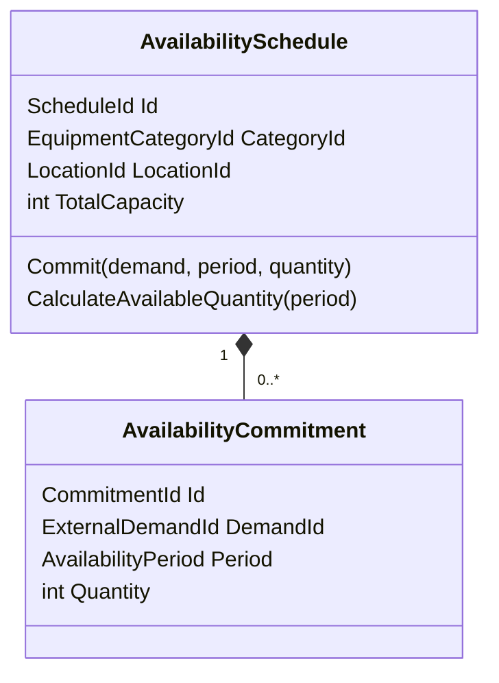
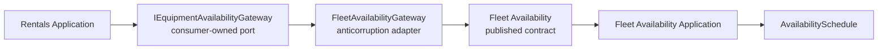

# Fleet Availability Bounded Context

## Purpose

Fleet Availability answers one business question:

> Can this equipment requirement be committed at this operational location for
> this period without breaking existing commitments?

It does not own commercial price, customer identity, rental lifecycle,
maintenance work, or physical asset dispatch.

## Aggregate boundary

`AvailabilitySchedule` is scoped to one equipment category and fulfilment
location. It owns constant total capacity and the commitments affecting that
capacity. This makes overbooking prevention strongly consistent inside one
aggregate.



## Capacity calculation

Availability is not `total capacity - sum of every overlapping commitment`.
Commitments that occupy different subperiods must not be counted
simultaneously.

The aggregate uses a sweep-line calculation:

1. clip each existing commitment to the requested period;
2. add quantity at overlap start;
3. subtract quantity at overlap end;
4. calculate peak simultaneous committed quantity;
5. subtract the peak from total capacity.

Half-open periods allow capacity ending on a date to be reused by another
commitment starting on that date.

## Expected rejection versus exception

Insufficient capacity is an expected business decision:

```text
Accepted = false
RejectionCode = fleet_availability.insufficient_capacity
AvailableQuantity = n
```

It is not an exception because “no capacity” is a normal outcome callers must
handle.

Invalid quantity, invalid period, or replaying one demand with different terms
violates model integrity and raises a domain exception.

## Idempotency

Fleet Availability treats the consumer-provided `DemandId` as opaque:

- the first valid request creates a commitment;
- an exact retry returns the original commitment;
- a retry with different period or quantity is rejected as a conflict.

The Fleet domain does not know that the current demand id is a Rentals line id.
That translation belongs to the adapter.

## Context integration



Important properties:

- Rentals Domain and Application reference no Fleet Availability assembly.
- Fleet Contracts reference no internal Fleet layer.
- The adapter depends only on the published contract, not Fleet Domain.
- Category, location, period, and commitment identifiers are translated; the
  contexts do not share Value Object classes.

The current published contract is called in-process. The consumer-owned port
allows a later HTTP/message transport without changing Rentals Application.

## Published Integration Event

An accepted new commitment raises `EquipmentAvailabilityCommitted` inside the
domain. Infrastructure maps it to
`fleet-availability.equipment-availability-committed.v1`.

The Integration Event:

- contains primitive identifiers rather than Fleet Value Objects;
- is stored in the Fleet Availability Outbox in the commitment transaction;
- keeps the same event/message id across publication retries;
- is published after commit with at-least-once semantics.

An idempotent replay that returns an existing commitment does not raise or
enqueue a second event.

`Release` is a real domain behavior used by compensating workflows. It keeps
the commitment as an audit record, sets `ReleasedAtUtc`, returns its capacity
to calculations, and publishes
`fleet-availability.equipment-availability-released.v1`. Retrying the same
release does not publish a second event.

Capacity definition also publishes
`fleet-availability.availability-capacity-defined.v1`. The Availability
Calendar consumes both facts to maintain a denormalized day-by-day CQRS read
model. This model never decides whether a commitment is valid; only the
aggregate can make that strongly consistent decision.

Read the detailed [CQRS Availability Calendar
guide](../architecture/cqrs-availability-calendar.md).

## Known consistency boundary

One order can contain lines belonging to different schedules. Committing all
lines cannot be one aggregate transaction.

The current use case commits one line at a time:

- accepted lines remain committed;
- rejected lines leave the Rental unconfirmed;
- retries are safe;
- release/compensation is not implemented yet.

The Rental Confirmation Process Manager now owns progress, timeout, release,
and compensation. Hiding this with a distributed transaction would
misrepresent the domain.

## Evolution risks

One schedule can become large or highly contended. Before changing the
aggregate boundary, measure commitment count, write contention, schedule query
cost, and business tolerance for temporary overbooking.

Possible future strategies include temporal partitioning, optimistic
concurrency retries, or a serialized command stream. They are not justified
yet.
