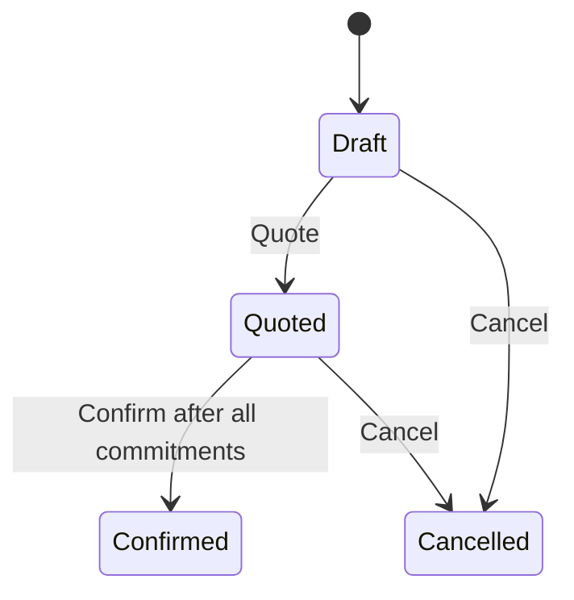

# Rentals Bounded Context

## Purpose

Rentals owns the customer's accepted commercial commitment and its lifecycle.
It does not own physical asset availability, maintenance condition, dispatch,
or invoicing.

## Aggregate

`RentalOrder` is the consistency boundary for:

- customer identity as known to Rentals;
- fulfilment location as known to Rentals;
- accepted rental period;
- commercial lines and rates;
- quote validity;
- references to external availability commitments;
- transition to confirmed.

It deliberately references an equipment **category**, not a physical asset.
Asset selection belongs to Fleet Availability. `FulfilmentLocationId` is
translated to Fleet's own `LocationId`; the identity classes are not shared.

## State transitions

Cancellation is part of the discovered language but is not implemented in the
first vertical slice. The diagram marks the intended model hypothesis, not a
claim of completed code.

## Value Objects

### Money

`Money` prevents:

- negative commercial amounts;
- missing/invalid three-letter currency codes;
- addition across currencies;
- inconsistent rounding.

It is immutable and compared by value.

### RentalPeriod

`RentalPeriod` is a half-open date interval: `[start, end)`.

This means a rental ending on 13 August and another beginning on 13 August do
not overlap. The decision removes “inclusive end at 23:59:59” ambiguity.

The first model uses `DateOnly`, explicitly limiting rentals to whole billable
days. Timezone and intra-day rental rules remain a documented hotspot.

## Why a line is an Entity

A `RentalLine` has identity because Fleet Availability returns a commitment for
a specific requested line. Two lines with identical values may participate in
different external conversations over time.

The line is internal to the aggregate and cannot be loaded through its own
repository.

## Domain Events

- `RentalOrderDrafted`
- `RentalLineAdded`
- `RentalOrderQuoted`
- `AvailabilityCommittedForRentalLine`
- `AvailabilityReleasedForRentalLine`
- `RentalOrderConfirmed`

They are past-tense domain facts. No event is published from the aggregate.
Persistence and dispatch reliability belong outside the domain model.

Only `RentalOrderConfirmed` currently has a proven external consumer-facing
meaning. Infrastructure maps it to the primitive, versioned
`rentals.rental-order-confirmed.v1` Integration Event and writes it to the
Rentals Outbox in the same transaction as the aggregate change.

## Repository

`IRentalOrderRepository` exists for the aggregate root only. The current
PostgreSQL adapter loads the aggregate with all lines and commits aggregate
changes, optimistic concurrency checks, and Outbox messages atomically.

The old in-memory adapter remains only as a simple test/demo alternative; it is
not the API's configured persistence adapter.

## Fleet Availability integration

Rentals Application owns `IEquipmentAvailabilityGateway`. The Infrastructure
adapter translates Rentals concepts to Fleet Availability's published contract.
Rentals Domain and Application have no compile-time dependency on Fleet
Availability.

The former endpoint that accepted an arbitrary commitment id has been removed.
A commitment can enter the Rental aggregate only after Fleet Availability has
accepted the actual category, location, quantity, and period.

Before calling Fleet, `PrepareAvailabilityRequest` verifies in the aggregate
that the order is quoted and the quote is still active. This prevents Fleet
from creating a commitment that Rentals would reject immediately afterward.

Multi-line confirmation is coordinated by a persisted Process Manager. It
commits one line at a time, confirms after all commitments succeed, and
releases earlier commitments after a rejection or timeout. The coordinator
uses Rentals' consumer-owned port and has no dependency on Fleet internals.

See the [Process Manager
guide](../architecture/rental-confirmation-process-manager.md) and
[ADR-0012](../decisions/0012-rental-confirmation-process-manager.md).

## Executable examples

The domain test names follow `Behavior_Scenario_Outcome`. Examples cover:

- quote calculation;
- quote expiry;
- immutable commercial terms after quote;
- currency consistency;
- exact-period commitments;
- confirmation only with complete availability;
- domain-event emission.
